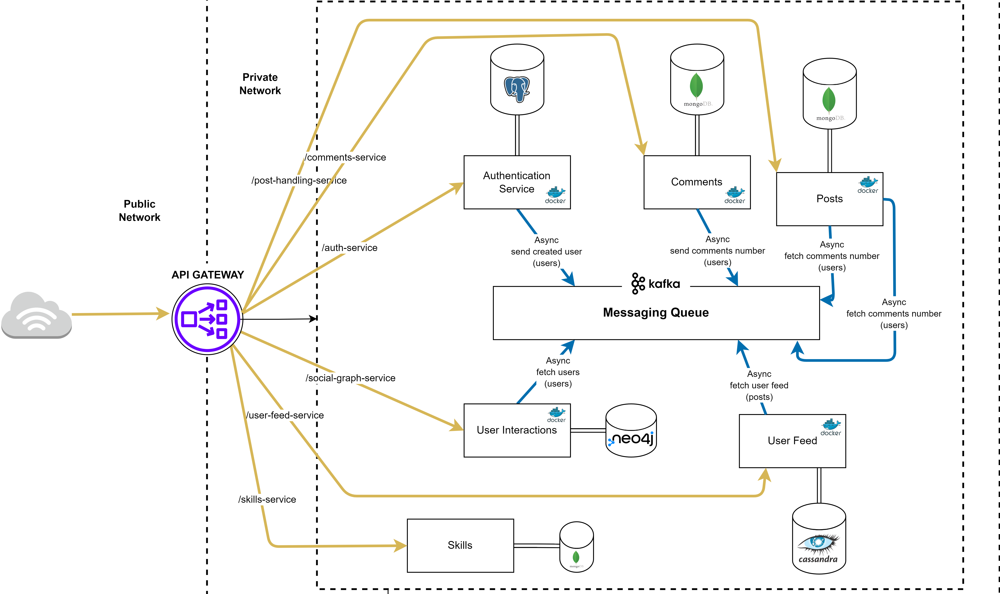
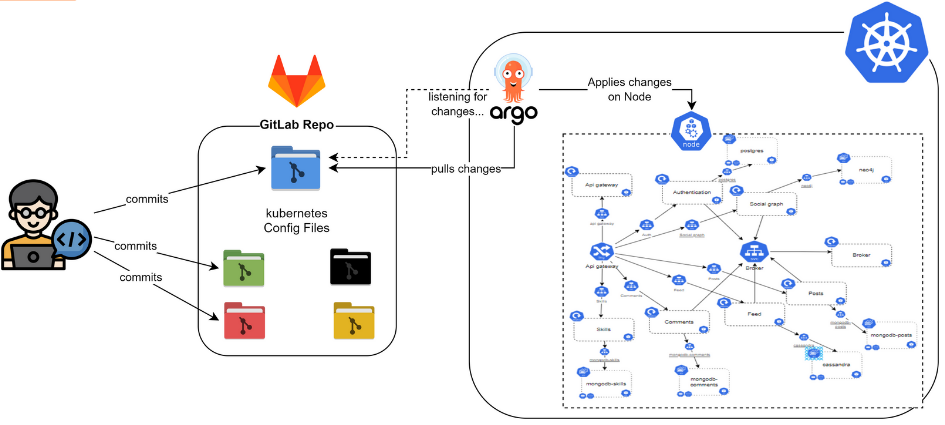

# You Scout

## Overview

You Scout is an innovative social mobile application designed to revolutionize talent discovery in football. Developed over a rigorous 3-month period as part of a final year project at INPT (Institut National des Postes et Télécommunications), You Scout aims to democratize the process of football talent scouting. It provides a platform where aspiring players can showcase their skills and connect with scouts and recruiters worldwide.

## Key Features

- User Authentication and Profile Management
- Video Upload and Sharing
- Skill Tagging and Evaluation
- Social Interactions (Follow, Like, Comment)
- Personalized Feed
- Search Functionality
- Real-time Notifications

## Project Development Methodology

### Agile Scrum Framework

We adopted the Agile Scrum framework for this project, which allowed us to work iteratively and respond quickly to changes and new requirements. Our Scrum process included:

- Sprint Planning: Bi-weekly sprints with clear goals and deliverables
- Daily Stand-ups: Quick team sync-ups to discuss progress and blockers
- Sprint Reviews: Demonstrations of completed work to stakeholders
- Sprint Retrospectives: Team reflections on process improvements

### Project Management with Jira

Jira was our primary tool for project management, helping us to:

- Create and manage user stories and tasks
- Track sprint progress with burndown charts
- Visualize workflow with Kanban boards
- Manage project backlog and prioritize features

## Architecture

You Scout is built on a modern, scalable microservices architecture, leveraging cloud-native technologies for optimal performance and flexibility.

### Microservices Design Process

We employed Domain-Driven Design (DDD) principles to architect our microservices. This process involved:

- **Strategic Design Phase**:
  • Event Storming sessions to identify key domain events and commands
  • Identifying and mapping Subdomains
  • Defining Bounded Contexts and their relationships
  • Creating a Context Map

- **Tactical Design Phase**:
  • Identifying Aggregates and Entities
  • Defining Value Objects
  • Designing Domain Events
  • Creating Repositories and Services

- **Iterative Refinement**:
  • Multiple design sessions to refine the architecture
  • Regular validation and feedback from our project supervisor
  • Continuous refinement of the Ubiquitous Language

This DDD approach ensured our microservices architecture was aligned with the business domain, promoting modularity and scalability in our You Scout application.

### General Architecture

This diagram illustrates the final microservices structure of You Scout, showing the various services and their interactions.

## Technologies Used

### Backend
- Spring Boot for microservices development
- PostgreSQL for user authentication and management
- Neo4j for managing user interactions
- MongoDB for handling posts, comments, and football skills
- Cassandra for feed generation and storage
- Apache Kafka for inter-service communication

### Frontend
- React Native for cross-platform mobile development
- Expo for simplified development and deployment

### DevOps and Deployment
- GitLab for version control and CI/CD pipeline
- Docker for containerization
- Kubernetes for container orchestration
- ArgoCD for continuous deployment
- Azure for cloud hosting

## Continuous Integration and Deployment (CI/CD)

You Scout employs a robust CI/CD pipeline to ensure rapid, reliable, and secure deployments.

### ArgoCD Role in Deployment

This diagram showcases how ArgoCD fits into our deployment process, automating the synchronization between our Git repository and the Kubernetes cluster.

## Project Timeline

The You Scout project was developed over an intensive 3-month period:

- Month 1: Requirements gathering, initial design, and architecture planning
- Month 2: Core feature development and integration of microservices
- Month 3: UI/UX refinement, testing, and deployment preparations

Despite the tight timeline, our Agile methodology allowed us to deliver a functional and feature-rich application.

## Authors

- ZAAM Oussama
- HAMDANE Yassine
- AARRASSE Ayoub

## Acknowledgments

- Mr. ALLAKI Driss (Project Supervisor)
- Institut National des Postes et Télécommunications (INPT)
- All contributors and testers who have helped shape You Scout
